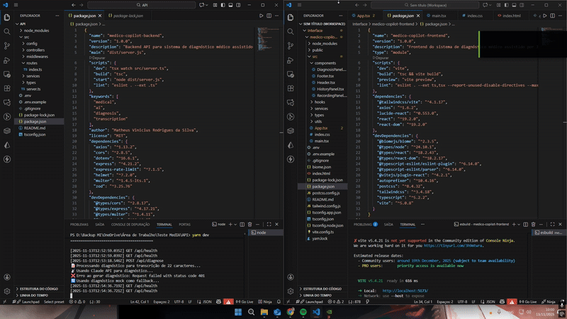

<h1 align="center">🩺 Médico Copilot</h1>

  

# 🩺 Médico Copilot — Frontend

Interface de um assistente médico inteligente que transforma
a fala do médico em hipóteses diagnósticas em tempo real.

O médico fala. O sistema escuta, processa e responde.

👉 Backend da aplicação: https://github.com/MaximillionDev1/medico-copilot-backend
🌐 Deploy: Em breve

---

## O que o sistema faz

- Captura a fala do médico em tempo real via microfone
- Se o navegador não suportar reconhecimento de voz, permite digitar manualmente
- Envia a transcrição para o backend processar via IA
- Exibe hipóteses diagnósticas, exames sugeridos e conduta
- Salva o histórico das últimas 20 consultas localmente

---

## Tecnologias

- React 18 + TypeScript
- Vite
- Tailwind CSS
- Axios
- Web Speech API

---

## Como rodar localmente

### 1. Clone o repositório
git clone https://github.com/MaximillionDev1/medico-copilot-frontend
cd medico-copilot-frontend

### 2. Instale as dependências
npm install

### 3. Configure o ambiente
cp .env.example .env
# Edite o .env e aponte para o backend:
# VITE_API_URL=http://localhost:3001

### 4. Rode o projeto
npm run dev
# Acesse: http://localhost:5173

> O backend precisa estar rodando para o sistema funcionar.
> Veja as instruções em: https://github.com/MaximillionDev1/medico-copilot-backend

---

## Estrutura de componentes

App.tsx
├── Header
├── HistoryPanel
├── RecordingPanel
│   └── useSpeechRecognition (hook)
├── DiagnosisPanel
└── Footer

---

## Próximos passos

- [ ] Autenticação de usuários (JWT)
- [ ] Streaming de diagnóstico em tempo real (WebSocket)
- [ ] Suporte a múltiplos idiomas
- [ ] Testes unitários com Vitest
- [ ] PWA

---

## Contato

Matheus Vinicius Rodrigues da Silva
matheusdevsilv4@gmail.com
linkedin.com/in/matheus-vinicius-dev

# Terminal 2 - Frontend
cd frontend && npm install && npm run dev

# Acesse: http://localhost:5173
